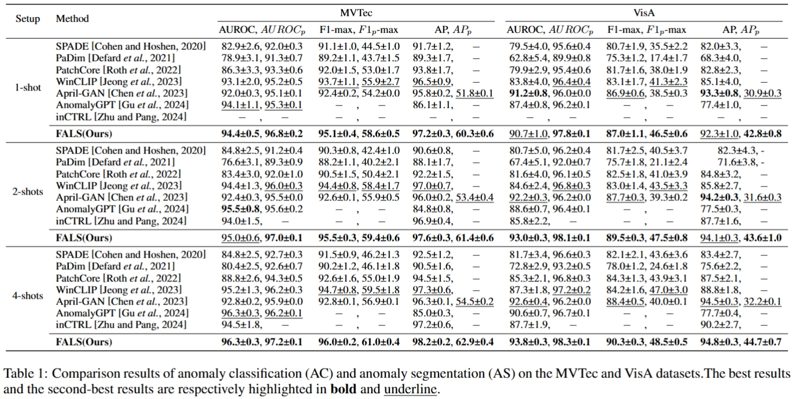

# FASL(Feature discrepancy guided Anomaly Score Learning for few-Shot anomaly detection)

> [2025]
>
> Primary Subject Area: CV:Transfer, low-shot, semi- and un- supervised learning  

## Abstract

Few-shot anomaly detection aims to identify and locate anomalies within images using only limited normal samples, which enables rapid adaptation to new applications in industrial quality control and safety monitoring. However, recent methods using multimodal pre-trained models mainly rely on statistical metrics to compare query and reference features, which could face challenges in handling interference from normal regions and capturing local contextual correlations between neighboring patches. To tackle this challenge, this paper proposes the Feature discrepancy guided Anomaly Score Learning (FASL) method. Specifically, FASL explicitly models deviations from normal patterns through a Feature Discrepancy (FD) module, which separates patch features into normal and deviation components. Moreover, an Anomaly Score Learning (ASL) module is introduced, which captures feature correlations and integrates neighboring information to generate more discriminative anomaly scores. To further detect small-area anomalies, a Local-enhanced Feature Extraction (LFE) mechanism focuses on small-area anomalies, while an image feature index memory bank optimizes memory usage by filtering redundant patch features. Experiments on the MVTec and VisA datasets show that this method **performs best** in 1-shot, 2-shots, and 4-shots segmentation tasks and is **highly competitive** in classification tasks. This demonstrates the method's effectiveness in few-shot scenarios and its ability to adapt quickly to new tasks with limited labeled data.

## OverView of FASL

 

Overview of FASL. To explicitly model feature derivation and learn discriminative anomaly scores, FASL mainly integrates three modules, i.e., Feature Discrepancy (FD) module, Anomaly Score Learning (ASL) module, and Local-enhanced Feature Extraction (LFE) mechanism. During training, the FD module creates differential feature maps from intermediate features, which the ASL module refines into anomaly score maps using ground truth for optimization. During testing, the LFE mechanism improves detection of small-area anomalies, and the outputs from both FD and ASL are merged to form the final anomaly score map.

## How to Run

### download datasets

MVTec: [click here](https://www.mvtec.com/company/research/datasets/mvtec-ad)

VisA: [click here](https://github.com/amazon-science/spot-diff)

### generate dataset JSON file

Taking the **MVTec** dataset as an example, generate the `meta.json` file.

Run the `mvtec.py` file provided in the `data` folder to generate the corresponding `meta.json` file.

~~~bash
cd data
python mvtec.py
~~~

Structure of **MVTec** Folder:

~~~
mvtec/
│
├── meta.json
│
├── bottle/
│   ├── ground_truth/
│   │   ├── broken_large/
│   │   │   └── 000_mask.png
|   |   |   └── ...
│   │   └── ...
│   └── test/
│       ├── broken_large/
│       │   └── 000.png
|       |   └── ...
│       └── ...
│   
└── ...
~~~

Apply the same approach to the **VisA** dataset.

### Run FASL

#### train and test

Quick train and test

run `trainAndTest.sh` , if `winmode=nan` means don't use **LFE**, `winmode=mul ` means use **LFE**

The parameters' meaning:

> model_name: 			your model name for train/test results
>
> device: 						cpu, cuda number
>
> useNAM:					use "Neighbor Aggregation Module" ?
>
> winmode:					option: nan, mul, onlywin
>
> win-size:					default: 13
>
> win-stride:				default: 2
>
> win-weight:				default: 0.5
>
> seed:							random seed
>
> kshots:						k-shots: 1, 2, 4

~~~bash
bash trainAndTest.sh {model_name} {device} {useNAM} {winmode} {win-size} {win-stride} {win-weight} {seed} {kshots}
~~~

for example:

**FASL** with **NAM** and **LFE**

~~~bash
bash trainAndTest.sh fasl 0 1 mul 13 2 0.5 14 1
~~~

**FASL** with **NAM** and without **LFE**

~~~bash
bash trainAndTest.sh fasl 0 1 nan 13 2 0.5 14 1
~~~

**FASL** without **NAM** and without **LFE**:

~~~bash
bash trainAndTest.sh fasl 0 0 nan 13 2 0.5 14 1
~~~

#### only test

~~~bash
bash test_few_shot.sh {model_name} {device} {useNAM} {winmode} {win-size} {win-stride} {win-weight} {seed} {kshots}
~~~

## Main Results

 

## Visualization
 

## Acknowledgements

We thank for the code repository: [open_clip](https://github.com/mlfoundations/open_clip), [VAND](https://github.com/ByChelsea/VAND-APRIL-GAN/tree/master), [AnomalyCLIP](https://github.com/zqhang/AnomalyCLIP),  and [WinCLIP](https://github.com/zqhang/Accurate-WinCLIP-pytorch).

